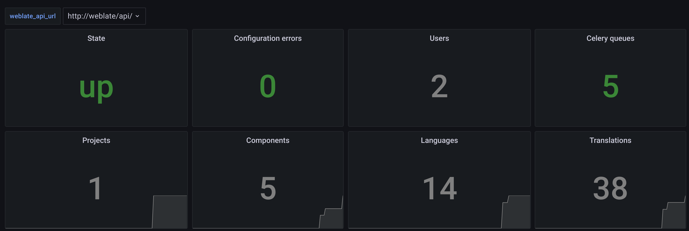
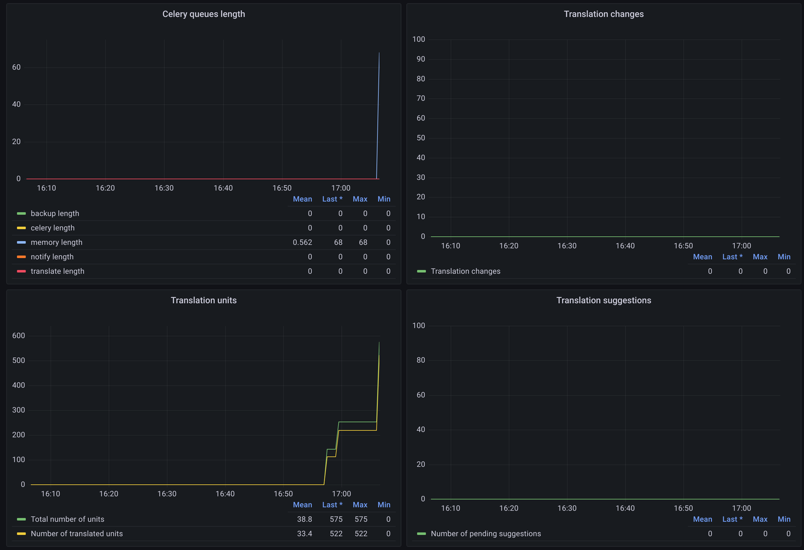

# IPerf prometheus exporter

Prometheus exporter for iperf server metrics

* [IPerf prometheus exporter](#iperf-prometheus-exporter)
  * [Building and running](#building-and-running)
    * [Prerequisites](#prerequisites)
    * [Setup an environment for developing and testing](#setup-an-environment-for-developing-and-testing)
    * [Build and test a docker image](#build-and-test-a-docker-image)
    * [Run the iperf\_exporter](#run-the-iperf_exporter)
      * [Helm](#helm)
      * [Docker](#docker)
    * [Grafana](#grafana)
  * [Developing and testing IPerf exporter](#developing-and-testing-iperf-exporter)

Supported versions:

## Building and running

### Prerequisites

* docker engine >= 20.10
* helm >= 3.7.1
* helm-docs >= 1.5.0
* make
* python >= 3.10 (used by tests only)
* python3-venv (used by tests only)

### Setup an environment for developing and testing

* Install prerequisites for developing and testing:

  ```shell
  sudo apt-get install python3-venv
  python3 -m venv venv
  source venv/bin/activate
  python -m pip install --upgrade pip

  # Install for tests only
  pip install -r requirements-test.txt

  # Install for developing
  pip install -r requirements-dev.txt
  ```

### Build and test a docker image

* Set up an image name and tag (optional):

    ```shell
    export IPERF_EXPORTER_SERVER_IMAGE_NAME=yourname/iperf_exporter_server
    export IPERF_EXPORTER_CLIENT_IMAGE_NAME=yourname/iperf_exporter_server
    export IPERF_EXPORTER_IMAGE_TAG=0.1.0
    ```

* Build and test the image:

    ```shell
    make build-images
    make test-images
    ```

### Run the iperf_exporter

#### Helm

* Install service monitor CRD

  ```shell
  kubectl apply -f https://raw.githubusercontent.com/prometheus-operator/prometheus-operator/v0.63.0/example/prometheus-operator-crd/monitoring.coreos.com_servicemonitors.yaml
  ```

* Add iperf-exporter helm repository:

  ```shell
    helm repo add iperf-exporter https://raw.githubusercontent.com/loktionovam/iperf_exporter/gh-pages/
    helm repo update
  ```

* Search available iperf-exporter helm charts:

  ```shell
    helm search repo --versions iperf-exporter

    NAME                             	CHART VERSION	APP VERSION	DESCRIPTION
    iperf-exporter/iperf-exporter-server	0.1.1        	v0.1.1     	IPerf prometheus metrics exporter

  ```

* Deploy new helm release:

  ```shell
  helm upgrade --install  iperf-exporter-server . --set image.tag=0.1.0-1-g7a5bfb6
  ```

* Run iperf exporter client:

  ```shell
  kubectl run iperf-exporter-client --image=loktionovam/iperf_exporter_client:0.1.0-1-g7a5bfb6 --env=IPERF_EXPORTER_CLIENT_PEER=172.17.0.4
  ```

* Check the exporter:

  ```shell
  kubectl port-forward svc/iperf-exporter-server 9868:9868
  curl http://localhost:9868/metrics
  ```

#### Docker

* Running using environment variables:

  ```shell
    docker run -p 9867:9867  -d yourname/iperf_exporter_server:0.1.0

    # Get the metrics
    curl http://localhost:9867/metrics/
  ```

### Grafana

How to import [IPerf metrics dashboard](./grafana/dashboards/iperf.json) described [here](https://grafana.com/docs/grafana/latest/dashboards/export-import/#import-dashboard)




## Developing and testing IPerf exporter

* Install prerequisites [as described here](#setup-an-environment-for-developing-and-testing) and activate python virtual environment
* Install pre-commit hooks

  ```shell
  source venv/bin/activate
  pre-commit install
  pre-commit install-hooks
  ```

* Format the code and run tests:

  ```shell
  make fmt
  make test-apps
  ```
