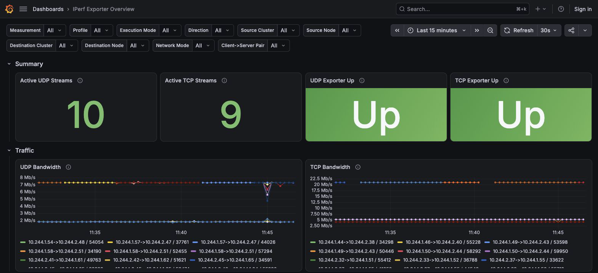

# IPerf Exporter

[](https://github.com/loktionovam/iperf_exporter/actions/workflows/ci.yml)
[](https://github.com/loktionovam/iperf_exporter/releases)

**Measure network quality between Kubernetes nodes and clusters, and explore
the results in Prometheus and Grafana.**

IPerf Exporter combines TCP/UDP measurements from **iperf2** with socket and
route diagnostics. The Kubernetes operator creates and manages both ends of
each measurement; the exporter also runs independently in Docker or Helm.

[Get started](#get-started) · [Installation](docs/installation.md) ·
[Dashboards](docs/dashboards.md) · [Metrics](docs/metrics.md) ·
[Operator API](docs/operator-crds.md)

## What you get

| Capability | What it tells you |
| --- | --- |
| TCP and UDP measurements | Throughput, packet loss, jitter and latency under a controlled traffic rate. |
| Per-stream diagnostics | Socket RTT, queues, retransmissions, congestion windows, path MTU and route snapshots alongside the test results. |
| Managed Kubernetes measurements | Select nodes, directions and `host`, `pod` or `service` paths; run continuously, once or periodically. |
| Cross-cluster measurements | Manage workloads in a remote cluster through a kubeconfig Secret, using host networking. |
| Three Grafana dashboards | Overview, TCP Quality and UDP Quality, with filters for measurements, nodes, clusters and connections. |



Browse all three dashboards in the [screenshot gallery](docs/dashboards.md).

## Choose your installation

| Option | Installs | Monitoring |
| --- | --- | --- |
| **Kubernetes operator** | Operator, four CRDs, RBAC and a metrics Service. Measurement resources create the clients and servers. | Connect your Prometheus and Grafana; optional ServiceMonitor resources. |
| [Standalone exporter](docs/installation.md#standalone-exporter) | An iperf2 server/exporter, with an optional client in the Helm chart. No operator or CRDs. | Connect your Prometheus and import the dashboards. |
| [Local demo](demo/README.md) | Sample clients and servers, Prometheus, Grafana and provisioned dashboards. The kind demo includes the operator and two clusters. | Included. |

Installing the operator does **not** start measurement traffic or install
Prometheus/Grafana. Create a profile and measurement to start collecting data.

## Get started

Use a Kubernetes cluster with two Linux nodes, `kubectl` and Helm. The operator
watches its installation namespace. The example below runs a 5 Mbit/s TCP
measurement from one node to another over the pod network.

### 1. Install the operator

```sh
helm repo add iperf-exporter https://raw.githubusercontent.com/loktionovam/iperf_exporter/gh-pages/
helm repo update
helm upgrade --install iperf-operator iperf-exporter/iperf-operator \
  --version 4.0.0 \
  --namespace iperf-measurements --create-namespace \
  --set localClusterName=cluster-a \
  --wait
```

If you use Prometheus Operator, add `--set serviceMonitor.enabled=true` and
the labels required by your Prometheus selector. See
[monitoring setup](docs/installation.md#prometheus-and-grafana).

### 2. Choose a profile and two nodes

Find the node names:

```sh
kubectl get nodes
```

Save the following as `measurement.yaml`, replacing `worker-a` and `worker-b`
with your node names:

```yaml
apiVersion: netperf.iperfexporter.io/v1
kind: MeasurementProfile
metadata:
  name: tcp-quality-continuous
spec:
  protocol: tcp
  exporter:
    clientBandwidth: 5M
    clientAdditionalParams: --trip-times
    serverAdditionalParams: --histograms=100u,20
---
apiVersion: netperf.iperfexporter.io/v1
kind: LinkMeasurement
metadata:
  name: tcp-baseline
spec:
  profileRef: tcp-quality-continuous
  source:
    cluster: cluster-a
    nodeName: worker-a
  destination:
    cluster: cluster-a
    nodeName: worker-b
  directions: [sourceToDestination]
  networkModes: [pod]
  execution:
    mode: continuous
```

### 3. Start measuring

```sh
kubectl -n iperf-measurements apply -f measurement.yaml
kubectl -n iperf-measurements get linkmeasurements,measurementsessions
```

The generated session reaches `Running` when both workloads are ready. Open
Grafana and filter by `measurement_id=tcp-baseline` to inspect its metrics.
Delete the `LinkMeasurement` to stop traffic and remove its generated workloads.

For UDP, scheduled probes and short throughput tests, choose a
[measurement profile](docs/profile-catalog.md). To compare paths or directions,
adjust `networkModes` and `directions` in the same measurement.

> [!NOTE]
> One-way latency requires synchronized clocks. Cross-cluster tests support
> `host` networking only; `pod` and `service` are single-cluster modes.
> Socket diagnostics describe the server side; route snapshots trace back
> from server to client. See [metric interpretation](docs/metrics.md).

## Try the complete demo

From a checkout, `make demo-kind-up` starts the operator, two kind clusters,
sample measurements, Prometheus and Grafana. It builds the local images and
runs the integration checks before printing the dashboard URLs.

For dashboards without Kubernetes, use `make demo-compose-up`.
Prerequisites and shutdown commands are in the [demo guides](demo/README.md).

## Documentation

- [Installation](docs/installation.md): operator, standalone exporter and monitoring.
- [Operator API](docs/operator-crds.md): profiles, clusters, measurements and sessions.
- [Profile catalog](docs/profile-catalog.md): continuous, periodic and one-shot scenarios.
- [Metrics reference](docs/metrics.md): labels, units and interpretation.
- [Grafana dashboards](docs/dashboards.md): screenshots and import instructions.
