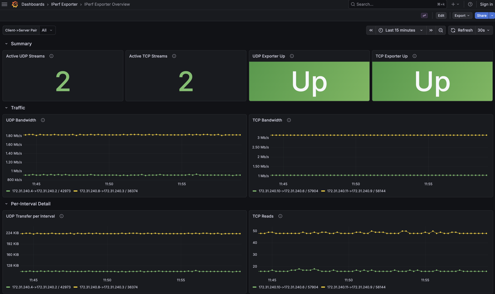
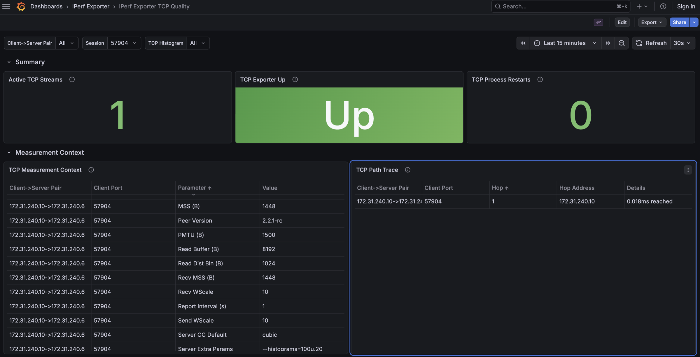
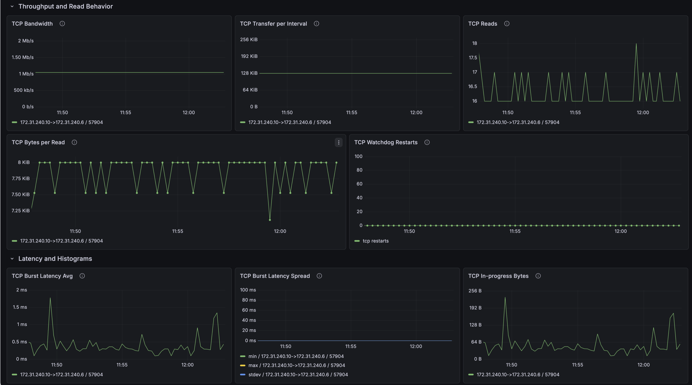
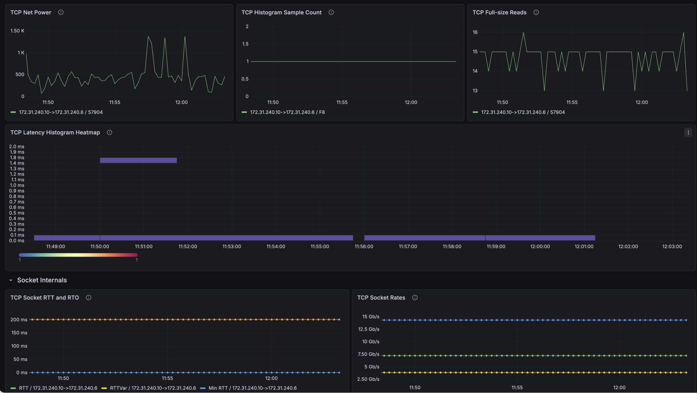
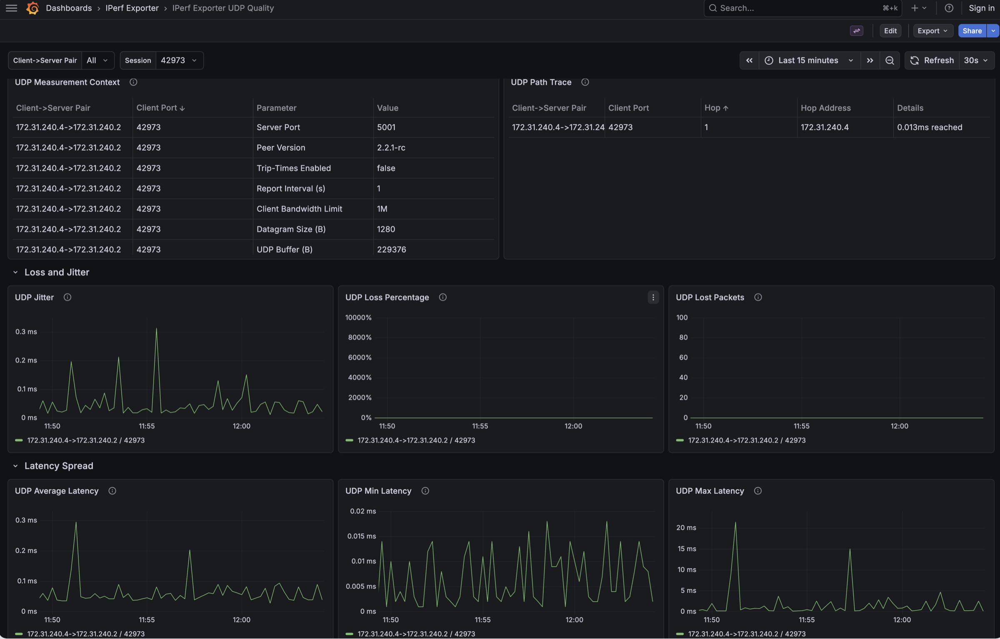

# IPerf prometheus exporter

Prometheus exporter for `iperf` server metrics with UDP and TCP support.

The exporter parses `iperf --server --enhanced` output, exposes per-stream metrics for Prometheus, keeps the child `iperf` process alive with an internal watchdog, and ships Grafana dashboards for overview and protocol-specific troubleshooting.

## Contents

- [Building and running](#building-and-running)
- [Kubernetes operator MVP](#kubernetes-operator-mvp)
- [Operator CRD reference](./docs/operator-crds.md)
- [Measurement profile catalog](./docs/profile-catalog.md)
- [Exported metrics](#exported-metrics)
- [Grafana](#grafana)
- [Developing and testing](#developing-and-testing-iperf-exporter)

## Building and running

### Prerequisites

- docker engine >= 20.10
- helm >= 3.7.1
- helm-docs >= 1.5.0
- make
- python >= 3.10
- python3-venv

### Setup an environment for developing and testing

```shell
sudo apt-get install python3-venv
python3 -m venv venv
source venv/bin/activate
python -m pip install --upgrade pip

# Install for tests only
pip install -r requirements-test.txt

# Install for developing
pip install -r requirements-dev.txt
```

### Build and test a docker image

```shell
export IPERF_EXPORTER_SERVER_IMAGE_NAME=yourname/iperf_exporter_server
export IPERF_EXPORTER_CLIENT_IMAGE_NAME=yourname/iperf_exporter_server
export IPERF_EXPORTER_IMAGE_TAG=0.1.0

make build-images
make test-images
```

### Run the iperf_exporter

#### Helm

Install the ServiceMonitor CRD:

```shell
kubectl apply -f https://raw.githubusercontent.com/prometheus-operator/prometheus-operator/v0.63.0/example/prometheus-operator-crd/monitoring.coreos.com_servicemonitors.yaml
```

Add the chart repository:

```shell
helm repo add iperf-exporter https://raw.githubusercontent.com/loktionovam/iperf_exporter/gh-pages/
helm repo update
helm search repo --versions iperf-exporter
```

Deploy a release:

```shell
helm upgrade --install iperf-exporter-server . --set image.tag=0.1.0-1-g7a5bfb6
```

Optionally enable an in-cluster client workload and place server/client on different nodes:

```shell
helm upgrade --install iperf-exporter-server . \
  --set image.tag=0.1.0-1-g7a5bfb6 \
  --set server.nodeSelector.node-role\\.kubernetes\\.io/infra=true \
  --set client.enabled=true \
  --set client.controller=DaemonSet \
  --set client.peer=iperf-exporter-server-iperf-exporter-server-server \
  --set server.config.additionalParams="--histograms=100u,20" \
  --set client.config.additionalParams="--trip-times" \
  --set client.nodeSelector.node-role\\.kubernetes\\.io/worker=true
```

Check the exporter:

```shell
kubectl port-forward svc/iperf-exporter-server 9868:9868
curl http://localhost:9868/metrics
```

#### Docker

Run with environment variables:

```shell
docker run -p 9867:9867 -d yourname/iperf_exporter_server:0.1.0

# Get the metrics
curl http://localhost:9867/metrics/
```

## Kubernetes operator MVP

There are now two demo catalogs under [demo/README.md](./demo/README.md):

- [docker-compose](./demo/docker-compose/README.md)
- [kind](./demo/kind/README.md)

Implemented controller scope:

- `MeasurementProfile`
- `RemoteCluster`
- `LinkMeasurement`
- generated `MeasurementSession`
- `execution.mode: continuous`
- `execution.mode: probe`
- `execution.mode: periodicProbe`
- `networkModes: host | pod | service`
- bidirectional expansion into separate sessions
- cross-cluster `host` measurements through a `RemoteCluster` kubeconfig

The profile is intentionally mapped to the exporter surface directly, so
`MeasurementProfile.spec.exporter` can set every exporter runtime option
currently supported by the CLI. The complete field-by-field reference is in
[docs/operator-crds.md](./docs/operator-crds.md), and the reusable scenario
profiles are cataloged in [docs/profile-catalog.md](./docs/profile-catalog.md).

Example profile:

```yaml
apiVersion: netperf.iperfexporter.io/v1alpha1
kind: MeasurementProfile
metadata:
  name: tcp-quality-continuous
spec:
  protocol: tcp
  exporter:
    port: 5001
    bindPort: 9868
    interval: 1
    len: 8192
    metricTTL: 120
    clientBandwidth: 5M
    clientDuration: 315360000
    clientAdditionalParams: --trip-times
    serverAdditionalParams: --histograms=100u,20
    pathTraceTTL: 60
    pathTraceMaxHops: 8
    pathTraceTimeout: 5
```

Example measurement:

```yaml
apiVersion: netperf.iperfexporter.io/v1alpha1
kind: LinkMeasurement
metadata:
  name: tcp-demo
spec:
  profileRef: tcp-quality-continuous
  source:
    cluster: cluster-a
    nodeName: iperf-demo-worker
  destination:
    cluster: cluster-a
    nodeName: iperf-demo-worker2
  directions:
    - sourceToDestination
    - destinationToSource
  networkModes:
    - host
    - pod
    - service
  execution:
    mode: continuous
```

Other supported execution modes:

- `probe`
  Runs one bounded client measurement and exits. In the kind demo these examples
  use higher burst bandwidth profiles.
- `periodicProbe`
  Keeps the server running and repeats a bounded client measurement every
  `execution.every`.

Cross-cluster host-only example:

```yaml
apiVersion: netperf.iperfexporter.io/v1alpha1
kind: RemoteCluster
metadata:
  name: cluster-b
spec:
  namespace: iperf-exporter-demo
  kubeconfigSecretRef:
    name: cluster-b-kubeconfig
    key: kubeconfig
---
apiVersion: netperf.iperfexporter.io/v1alpha1
kind: LinkMeasurement
metadata:
  name: tcp-cross-cluster-demo
spec:
  profileRef: tcp-quality-cross-cluster
  source:
    cluster: cluster-a
    nodeName: iperf-demo-worker
  destination:
    cluster: cluster-b
    nodeName: iperf-demo-remote-worker
  directions:
    - sourceToDestination
    - destinationToSource
  networkModes:
    - host
  execution:
    mode: continuous
```

Cross-cluster note:

- `host` is currently the only supported `networkMode` when
  `source.cluster != destination.cluster`
- `pod` and `service` remain single-cluster-only unless those networks are
  intentionally routed between clusters

Bring up the demo cluster:

```sh
make demo-kind-up
```

This also installs:

- Prometheus at `http://prometheus.127.0.0.1.nip.io:8080`
- Grafana at `http://grafana.127.0.0.1.nip.io:8080`
- the provisioned dashboards `iperf-exporter-overview`, `iperf-exporter-tcp-quality`, `iperf-exporter-udp-quality`
- a second kind cluster used by the `tcp-cross-cluster-demo` example

The kind demo builds two separate images:

- `iperf_exporter:kind-demo` for server/client exporter workloads
- `iperf_operator:kind-demo` for the `kopf` controller

Kind demo example resources:

- continuous:
  - [measurement-tcp.yaml](./demo/kind/examples/measurement-tcp.yaml)
  - [measurement-udp.yaml](./demo/kind/examples/measurement-udp.yaml)
- periodic probes:
  - [measurement-tcp-periodic.yaml](./demo/kind/examples/measurement-tcp-periodic.yaml)
  - [measurement-udp-periodic.yaml](./demo/kind/examples/measurement-udp-periodic.yaml)
- oneshot probes with higher bandwidth:
  - [measurement-tcp-probe.yaml](./demo/kind/examples/measurement-tcp-probe.yaml)
  - [measurement-udp-probe.yaml](./demo/kind/examples/measurement-udp-probe.yaml)
- cross-cluster:
  - [remote-cluster-b.yaml](./demo/kind/examples/remote-cluster-b.yaml)
  - [profile-tcp-quality-cross-cluster.yaml](./demo/kind/examples/profile-tcp-quality-cross-cluster.yaml)
  - [measurement-tcp-cross-cluster.yaml](./demo/kind/examples/measurement-tcp-cross-cluster.yaml)

Reusable non-demo profiles:

- [examples/profiles](./examples/profiles/README.md)

Verify created entities:

```sh
kubectl --context kind-iperf-demo -n iperf-exporter-demo get measurementprofiles
kubectl --context kind-iperf-demo -n iperf-exporter-demo get remoteclusters
kubectl --context kind-iperf-demo -n iperf-exporter-demo get linkmeasurements
kubectl --context kind-iperf-demo -n iperf-exporter-demo get measurementsessions
```

`host` mode uses `hostNetwork=true`, so co-located server sessions on the same node must not share the same exporter `bindPort`. The demo profiles intentionally use different metrics ports for TCP and UDP host-mode sessions.

## Exported metrics

### Common labels on per-stream metrics

All UDP and TCP stream metrics share the same label set:

| Label | Meaning |
| --- | --- |
| `peer_id` | Connection identifier emitted by `iperf`. |
| `local_address` | Server-side local address that accepted the stream. |
| `interface_name` | Interface suffix parsed from the local address if present in `iperf` output. |
| `local_port` | Server-side listening port. |
| `peer_address` | Client address seen by the server. |
| `peer_port` | Client source port seen by the server. |
| `connection_pair` | Convenience label in the form `<peer_address>-><local_address>`, intended for Grafana filtering by client/server pair. |
| `measurement_id` | Optional higher-level measurement identifier. Populated by the kind operator; empty for standalone runs. |
| `profile_ref` | Optional `MeasurementProfile` reference name. Populated by the kind operator; empty for standalone runs. |
| `session_id` | Optional session identifier. Populated by the kind operator; empty for standalone runs. |
| `execution_mode` | Optional execution mode such as `continuous`, `probe` or `periodicProbe`. Populated by the kind operator; empty for standalone runs. |
| `direction` | Optional direction such as `sourceToDestination` or `destinationToSource`. Populated by the kind operator; empty for standalone runs. |
| `network_mode` | Optional topology hint such as `host`, `pod` or `service`. Populated by the kind operator; empty for standalone runs. |
| `src_node` | Optional source node name. Populated by the kind operator; empty for standalone runs. |
| `dst_node` | Optional destination node name. Populated by the kind operator; empty for standalone runs. |
| `src_cluster` | Optional source cluster name. Populated by the kind operator; empty for standalone runs. |
| `dst_cluster` | Optional destination cluster name. Populated by the kind operator; empty for standalone runs. |

### UDP metrics

These metrics are created from UDP server-side interval reports.

| Metric | Unit | Meaning |
| --- | --- | --- |
| `iperf_exporter_udp_transfer` | bytes | Payload transferred during the reporting interval. |
| `iperf_exporter_udp_bandwidth` | bits/sec | UDP bitrate reported by `iperf` for the interval. |
| `iperf_exporter_udp_jitter` | ms | UDP jitter reported by `iperf`. |
| `iperf_exporter_udp_lost` | packets | Lost UDP packets during the interval. |
| `iperf_exporter_udp_total` | packets | Total UDP packets sent during the interval. |
| `iperf_exporter_udp_lost_percentage` | percent | Packet loss percentage for the interval. |
| `iperf_exporter_udp_latency_avg` | ms | Average latency reported by `iperf`. |
| `iperf_exporter_udp_latency_min` | ms | Minimum latency reported by `iperf`. |
| `iperf_exporter_udp_latency_max` | ms | Maximum latency reported by `iperf`. |
| `iperf_exporter_udp_latency_stdev` | ms | Latency standard deviation reported by `iperf`. |
| `iperf_exporter_udp_pps` | packets/sec | Packets per second reported by `iperf`. |
| `iperf_exporter_udp_netpwr` | iperf2 net power | Net power value from `iperf2` enhanced output. This is an `iperf2`-specific composite signal, not a Prometheus or IETF standard metric. |

### UDP test-condition info metric

This metric captures the static context for each UDP stream so Grafana can answer "under what conditions was this measured?" directly from labels. In server mode you can also populate optional client-side launch hints with `IPERF_EXPORTER_CONTEXT_CLIENT_BANDWIDTH` and `IPERF_EXPORTER_CONTEXT_CLIENT_ADDITIONAL_PARAMS`.

| Metric | Unit | Meaning |
| --- | --- | --- |
| `iperf_exporter_udp_test_info` | info | Gauge with constant value `1`. Labels carry the test context: `peer_version`, `trip_times_enabled`, `report_interval_seconds`, optional `client_bandwidth_limit`, optional `client_additional_params`, `server_len_bytes`, `server_udp_buffer_bytes` and `server_additional_params`. |

### UDP path-trace metrics

These metrics are sampled with `tracepath -n` from the exporter/server network namespace toward the peer/client address and cached for `IPERF_EXPORTER_PATH_TRACE_TTL` seconds. They show the route observed from server to client, which may differ from the reverse client-to-server path that carried the measured traffic.

| Metric | Unit | Meaning |
| --- | --- | --- |
| `iperf_exporter_udp_path_trace_success` | bool | `1` when the last cached `tracepath` run reached the peer/client address. |
| `iperf_exporter_udp_path_trace_pmtu_bytes` | bytes | Path MTU reported by `tracepath`. |
| `iperf_exporter_udp_path_trace_hops_total` | hops | Hop count reported by `tracepath`. |
| `iperf_exporter_udp_path_trace_hop_info` | info | Gauge with constant value `1`. Labels carry one hop from the last cached trace snapshot: `trace_direction`, `hop_index`, `hop_address` and `hop_summary`. |

### UDP socket metrics

These metrics are server-side kernel socket snapshots collected from `ss -uin` and matched to active `iperf` peers by local/remote address and port.

| Metric | Unit | Meaning |
| --- | --- | --- |
| `iperf_exporter_udp_socket_recv_queue_bytes` | bytes | Bytes currently queued in the UDP receive queue on the exporter host. |
| `iperf_exporter_udp_socket_send_queue_bytes` | bytes | Bytes currently queued in the UDP send queue on the exporter host. |

### TCP metrics

These metrics are created from TCP server-side interval reports. Some of them are only available when the client runs with `--trip-times` and the server runs with `--histograms=...`.

| Metric | Unit | Meaning |
| --- | --- | --- |
| `iperf_exporter_tcp_transfer` | bytes | Payload transferred during the reporting interval. |
| `iperf_exporter_tcp_bandwidth` | bits/sec | TCP bitrate reported by `iperf` for the interval. |
| `iperf_exporter_tcp_reads` | reads | Number of server-side TCP read operations reported by `iperf` for the interval. |
| `iperf_exporter_tcp_burst_latency_avg` | ms | Average TCP write-to-read latency reported by `iperf2 --trip-times`. |
| `iperf_exporter_tcp_burst_latency_min` | ms | Minimum TCP write-to-read latency reported by `iperf2 --trip-times`. |
| `iperf_exporter_tcp_burst_latency_max` | ms | Maximum TCP write-to-read latency reported by `iperf2 --trip-times`. |
| `iperf_exporter_tcp_burst_latency_stdev` | ms | TCP write-to-read latency standard deviation reported by `iperf2 --trip-times`. |
| `iperf_exporter_tcp_burst_count` | bursts | Number of TCP bursts included in the reporting interval. |
| `iperf_exporter_tcp_burst_size` | bytes | TCP burst size reported by `iperf2` for the reporting interval. |
| `iperf_exporter_tcp_inprogress_bytes` | bytes | Bytes reported by `iperf2` as still in progress / queued at the receiver. |
| `iperf_exporter_tcp_netpwr` | iperf2 net power | TCP net power value from `iperf2` enhanced trip-times output. |
| `iperf_exporter_tcp_read_bin_0` | reads | Count of reads in `Reads=Dist` bin 0. |
| `iperf_exporter_tcp_read_bin_1` | reads | Count of reads in `Reads=Dist` bin 1. |
| `iperf_exporter_tcp_read_bin_2` | reads | Count of reads in `Reads=Dist` bin 2. |
| `iperf_exporter_tcp_read_bin_3` | reads | Count of reads in `Reads=Dist` bin 3. |
| `iperf_exporter_tcp_read_bin_4` | reads | Count of reads in `Reads=Dist` bin 4. |
| `iperf_exporter_tcp_read_bin_5` | reads | Count of reads in `Reads=Dist` bin 5. |
| `iperf_exporter_tcp_read_bin_6` | reads | Count of reads in `Reads=Dist` bin 6. |
| `iperf_exporter_tcp_read_bin_7` | reads | Count of reads in `Reads=Dist` bin 7. |
| `iperf_exporter_tcp_latency_histogram_bin_count` | samples | Raw count stored in one TCP latency histogram bin. This metric adds `histogram_name`, `upper_bound_seconds` and `upper_bound_ms` labels. |
| `iperf_exporter_tcp_latency_histogram_bucket` | samples | Cumulative TCP latency histogram buckets with Prometheus-style `le` labels in milliseconds, intended for heatmap-style visualizations. |
| `iperf_exporter_tcp_latency_histogram_sample_count` | samples | Total number of samples in one TCP latency histogram snapshot. This metric adds the `histogram_name` label. |
| `iperf_exporter_tcp_latency_histogram_bin_width_seconds` | seconds | Width of one TCP latency histogram bin. This metric adds the `histogram_name` label. |

TCP notes:

- `iperf_exporter_tcp_read_bin_<0..7>` comes from the `Reads=Dist` field in `iperf2` enhanced output. The exact byte boundaries depend on the server read buffer configuration shown by `iperf`.
- `burst_*`, `inprogress_bytes`, `netpwr` and `tcp_latency_histogram_*` require `--trip-times` on the client. Histogram metrics additionally require `--histograms=...` on the server.

### TCP test-condition info metric

This metric captures the static context for each TCP stream so Grafana can show how a given pair was measured. In server mode you can also populate optional client-side launch hints with `IPERF_EXPORTER_CONTEXT_CLIENT_BANDWIDTH` and `IPERF_EXPORTER_CONTEXT_CLIENT_ADDITIONAL_PARAMS`.

| Metric | Unit | Meaning |
| --- | --- | --- |
| `iperf_exporter_tcp_test_info` | info | Gauge with constant value `1`. Labels carry the test context: `peer_version`, `trip_times_enabled`, `report_interval_seconds`, optional `client_bandwidth_limit`, optional `client_additional_params`, `initial_cwnd_segments`, `initial_mss_bytes`, `initial_rtt_microseconds`, `server_len_bytes`, `server_window_bytes`, `server_read_buffer_bytes`, `server_read_dist_bin_width_bytes`, `server_histogram_bin_width_ms`, `server_histogram_bin_count`, `server_congestion_control_default` and `server_additional_params`. |

### TCP path-trace metrics

These metrics are sampled with `tracepath -n` from the exporter/server network namespace toward the peer/client address and cached for `IPERF_EXPORTER_PATH_TRACE_TTL` seconds. They show the route observed from server to client, which may differ from the reverse client-to-server path that carried the measured traffic.

| Metric | Unit | Meaning |
| --- | --- | --- |
| `iperf_exporter_tcp_path_trace_success` | bool | `1` when the last cached `tracepath` run reached the peer/client address. |
| `iperf_exporter_tcp_path_trace_pmtu_bytes` | bytes | Path MTU reported by `tracepath`. |
| `iperf_exporter_tcp_path_trace_hops_total` | hops | Hop count reported by `tracepath`. |
| `iperf_exporter_tcp_path_trace_hop_info` | info | Gauge with constant value `1`. Labels carry one hop from the last cached trace snapshot: `trace_direction`, `hop_index`, `hop_address` and `hop_summary`. |

### TCP socket metrics

These metrics are server-side kernel socket snapshots collected from `ss -tin` and matched to active `iperf` peers by local/remote address and port. Unlike the interval metrics above, these values are instantaneous scrape-time socket state and can reset when the TCP connection is re-established.

| Metric | Unit | Meaning |
| --- | --- | --- |
| `iperf_exporter_tcp_socket_recv_queue_bytes` | bytes | Bytes currently queued in the TCP receive queue on the exporter host. |
| `iperf_exporter_tcp_socket_send_queue_bytes` | bytes | Bytes currently queued in the TCP send queue on the exporter host. |
| `iperf_exporter_tcp_socket_info` | info | Gauge with constant value `1`. Labels carry stable negotiated socket properties from `ss`: `congestion_algorithm`, `socket_state`, `mss_bytes`, `pmtu_bytes`, `rcvmss_bytes`, `advmss_bytes`, `send_wscale` and `rcv_wscale`. |
| `iperf_exporter_tcp_socket_app_limited` | bool | `1` when `ss` reports the socket as `app_limited`, otherwise `0`. |
| `iperf_exporter_tcp_socket_rto_milliseconds` | ms | TCP retransmission timeout from `ss`. |
| `iperf_exporter_tcp_socket_rtt_milliseconds` | ms | Smoothed TCP RTT from `ss`. |
| `iperf_exporter_tcp_socket_rttvar_milliseconds` | ms | TCP RTT variation from `ss`. |
| `iperf_exporter_tcp_socket_ato_milliseconds` | ms | TCP delayed ACK timeout from `ss`. |
| `iperf_exporter_tcp_socket_mss_bytes` | bytes | Maximum segment size from `ss`. |
| `iperf_exporter_tcp_socket_pmtu_bytes` | bytes | Path MTU from `ss`. |
| `iperf_exporter_tcp_socket_rcvmss_bytes` | bytes | Receive MSS from `ss`. |
| `iperf_exporter_tcp_socket_advmss_bytes` | bytes | Advertised MSS from `ss`. |
| `iperf_exporter_tcp_socket_cwnd_segments` | segments | Congestion window from `ss`. |
| `iperf_exporter_tcp_socket_bytes_sent` | bytes | Total bytes sent on the socket according to `ss`. |
| `iperf_exporter_tcp_socket_bytes_acked` | bytes | Total bytes acknowledged on the socket according to `ss`. |
| `iperf_exporter_tcp_socket_bytes_received` | bytes | Total bytes received on the socket according to `ss`. |
| `iperf_exporter_tcp_socket_segs_out` | segments | Total TCP segments sent according to `ss`. |
| `iperf_exporter_tcp_socket_segs_in` | segments | Total TCP segments received according to `ss`. |
| `iperf_exporter_tcp_socket_data_segs_out` | segments | Total TCP data segments sent according to `ss`. |
| `iperf_exporter_tcp_socket_data_segs_in` | segments | Total TCP data segments received according to `ss`. |
| `iperf_exporter_tcp_socket_send_rate_bps` | bits/sec | Sender throughput estimate from `ss`. |
| `iperf_exporter_tcp_socket_pacing_rate_bps` | bits/sec | Kernel TCP pacing rate from `ss`. |
| `iperf_exporter_tcp_socket_delivery_rate_bps` | bits/sec | TCP delivery rate estimate from `ss`. |
| `iperf_exporter_tcp_socket_delivered` | packets | Delivered packets counter from `ss`. |
| `iperf_exporter_tcp_socket_rcv_rtt_milliseconds` | ms | Receiver-side RTT from `ss`. |
| `iperf_exporter_tcp_socket_rcv_space_bytes` | bytes | TCP receive space from `ss`. |
| `iperf_exporter_tcp_socket_rcv_ssthresh_bytes` | bytes | TCP receive slow-start threshold from `ss`. |
| `iperf_exporter_tcp_socket_min_rtt_milliseconds` | ms | Minimum RTT from `ss`. |
| `iperf_exporter_tcp_socket_lastsnd_milliseconds` | ms | Milliseconds since the last TCP send. |
| `iperf_exporter_tcp_socket_lastrcv_milliseconds` | ms | Milliseconds since the last TCP receive. |
| `iperf_exporter_tcp_socket_lastack_milliseconds` | ms | Milliseconds since the last TCP ACK. |
| `iperf_exporter_tcp_socket_snd_wnd_bytes` | bytes | Sender window size from `ss`. |
| `iperf_exporter_tcp_socket_rcv_wnd_bytes` | bytes | Receiver window size from `ss`. |
| `iperf_exporter_tcp_socket_send_wscale` | scale factor | Send window scale from `ss`. |
| `iperf_exporter_tcp_socket_rcv_wscale` | scale factor | Receive window scale from `ss`. |

TCP socket notes:

- These values come from `ss -tin`, not from `iperf` interval output. They represent current kernel socket state on the exporter host.
- Queue, RTT, pacing and window metrics are only emitted while a matching socket exists for the current `connection_pair`.
- The exporter is best-effort here: if `ss` is unavailable or returns no matching row, the scrape still succeeds and only the socket metrics are absent.

### Process health metrics

These metrics are exporter-wide and describe the supervised child `iperf` process:

| Metric | Labels | Meaning |
| --- | --- | --- |
| `iperf_exporter_iperf_process_up` | `mode`, `proto` | `1` when the supervised `iperf` process is alive, `0` when it is not. |
| `iperf_exporter_iperf_process_restarts_total` | `mode`, `proto` | Number of automatic restarts performed by the exporter watchdog. |
| `iperf_exporter_iperf_process_last_exit_code` | `mode`, `proto` | Last observed child process exit code. This metric appears after the first observed exit. |

## Grafana

Dashboards are available in:

- [Overview dashboard](./grafana/dashboards/iperf-exporter-overview.json)
- [UDP quality dashboard](./grafana/dashboards/iperf-exporter-udp-quality.json)
- [TCP quality dashboard](./grafana/dashboards/iperf-exporter-tcp-quality.json)

Dashboard notes:

- Every panel has a Grafana panel description that explains what the metric means and how to read it.
- The dashboards expose a `Client->Server Pair` variable based on the `connection_pair` label, so you can optionally scope graphs to a single client/server path.
- The overview dashboard mixes UDP/TCP traffic and exporter health.
- The UDP quality dashboard starts with `UDP Measurement Context` and `UDP Path Trace` tables so you can see launch parameters, client bandwidth hints and the server-to-client route before looking at jitter/loss graphs.
- The TCP quality dashboard starts with `TCP Measurement Context` and `TCP Path Trace` tables so you can see launch parameters, parsed peer capabilities, bandwidth limits, congestion control, MSS, PMTU, negotiated window scaling and the server-to-client route before reading the throughput and latency panels.

Import dashboards as described in the Grafana docs:

https://grafana.com/docs/grafana/latest/dashboards/export-import/#import-dashboard

The local demo stack provisions dashboards automatically from [grafana/dashboards](./grafana/dashboards).

Screenshots:

- [Overview screenshot](./grafana/img/iperf-exporter-overview.png)
- [TCP quality screenshot 1](./grafana/img/iperf-exporter-tcp-quality-1.png)
- [TCP quality screenshot 2](./grafana/img/iperf-exporter-tcp-quality-2.png)
- [TCP quality screenshot 3](./grafana/img/iperf-exporter-tcp-quality-3.png)
- [UDP quality screenshot](./grafana/img/iperf-exporter-udp-quality-1.png)







## Developing and testing IPerf exporter

Install prerequisites as described above and activate the virtual environment:

```shell
source venv/bin/activate
pre-commit install
pre-commit install-hooks
```

Format the code and run tests:

```shell
make fmt
make test-apps
```
