# Grafana dashboards

Three dashboards cover traffic, connection quality and measurement health.
They share filters for clusters, nodes, measurements and connection pairs.

Import the JSON files below into Grafana using **Dashboards → New → Import**,
then select your Prometheus datasource. The [local demos](../demo/README.md)
provision all three automatically. For collection setup, see
[installation](installation.md#prometheus-and-grafana).

These screenshots show real measurements from the kind demo. Zero losses or
retransmissions are valid results; error counters show actual demo events.

## Overview

[Dashboard JSON](../grafana/dashboards/iperf-exporter-overview.json)

Active streams and TCP/UDP traffic.

Per-interval transfer and read activity.

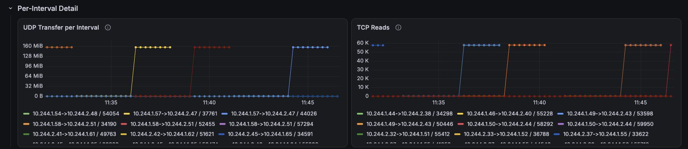

Data freshness, test outcomes and exporter errors.

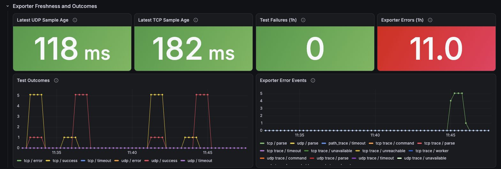

Operator availability, reconciliation and remote-cluster health.

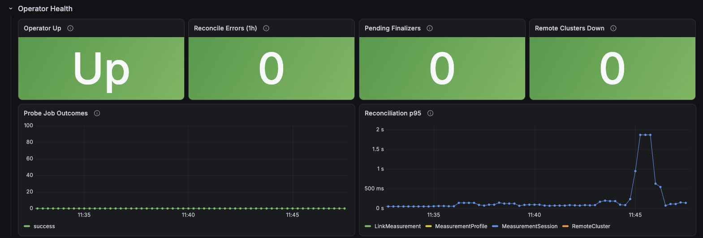

## TCP Quality

[Dashboard JSON](../grafana/dashboards/iperf-exporter-tcp-quality.json)

Measurement parameters and the observed server-to-client route.

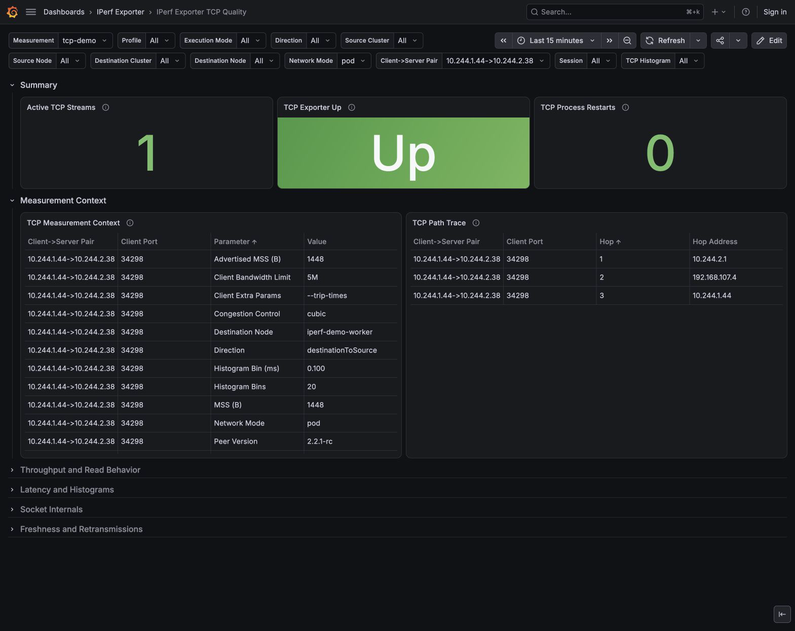

Throughput and server read behavior.

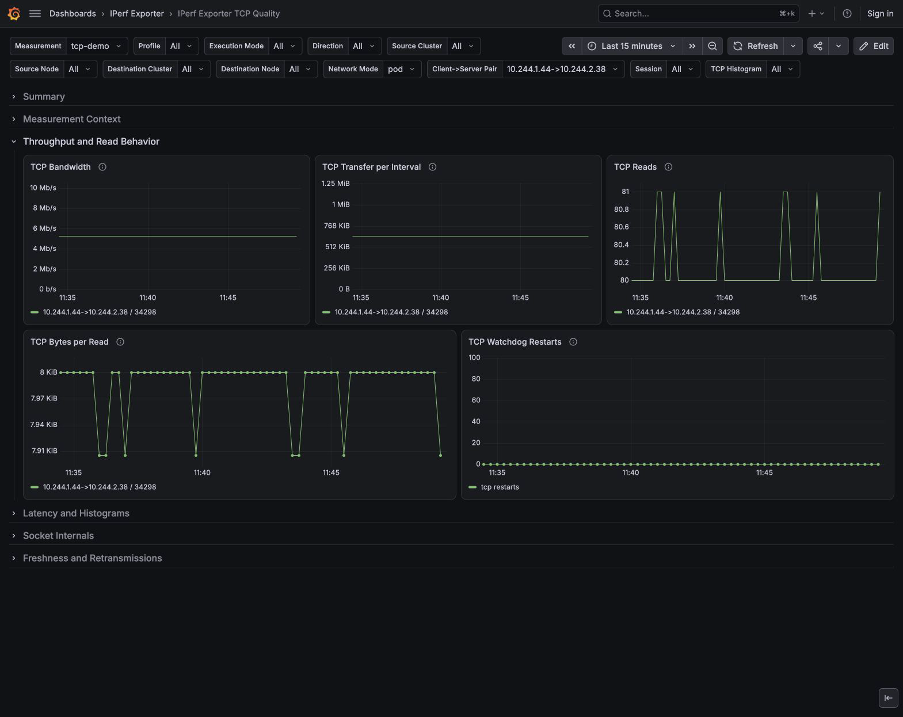

Burst latency and its distribution.

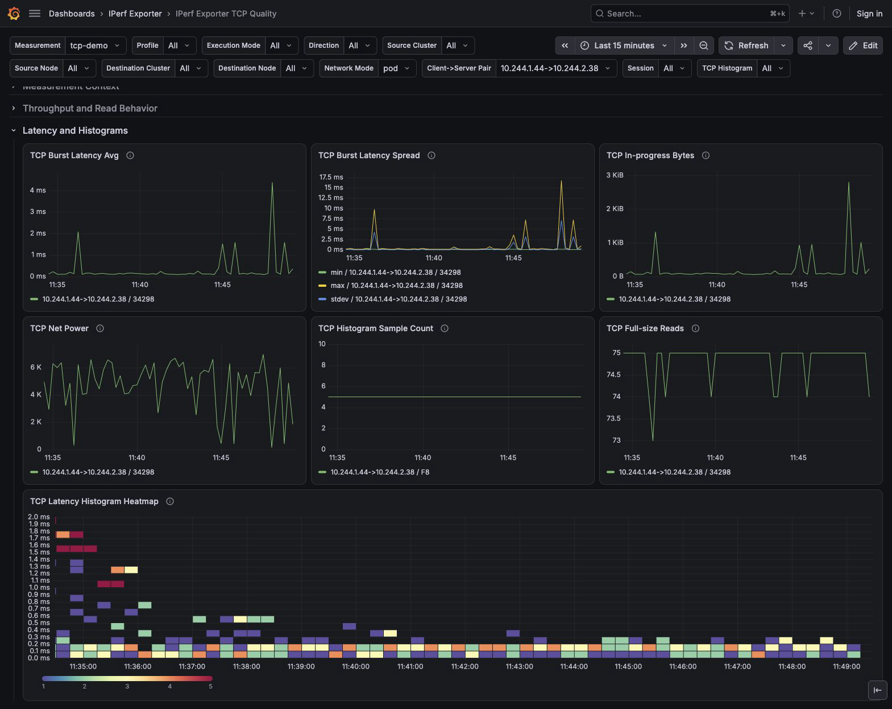

Socket state and retransmissions.

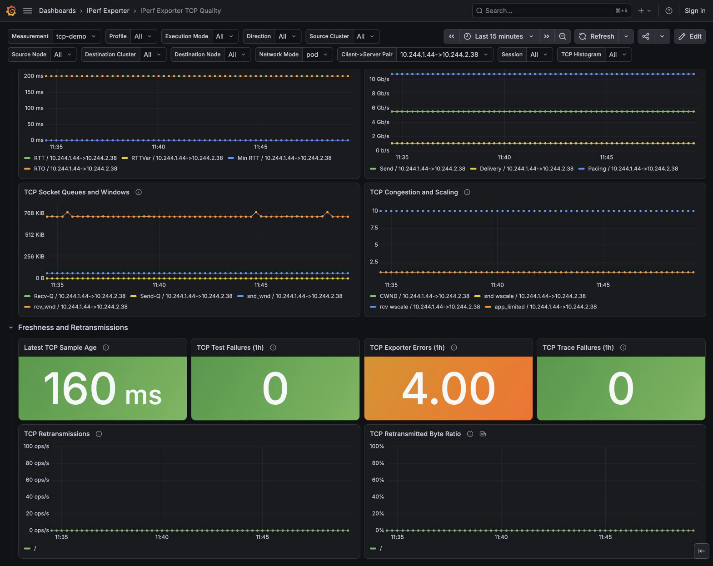

## UDP Quality

[Dashboard JSON](../grafana/dashboards/iperf-exporter-udp-quality.json)

Measurement parameters and the observed server-to-client route.

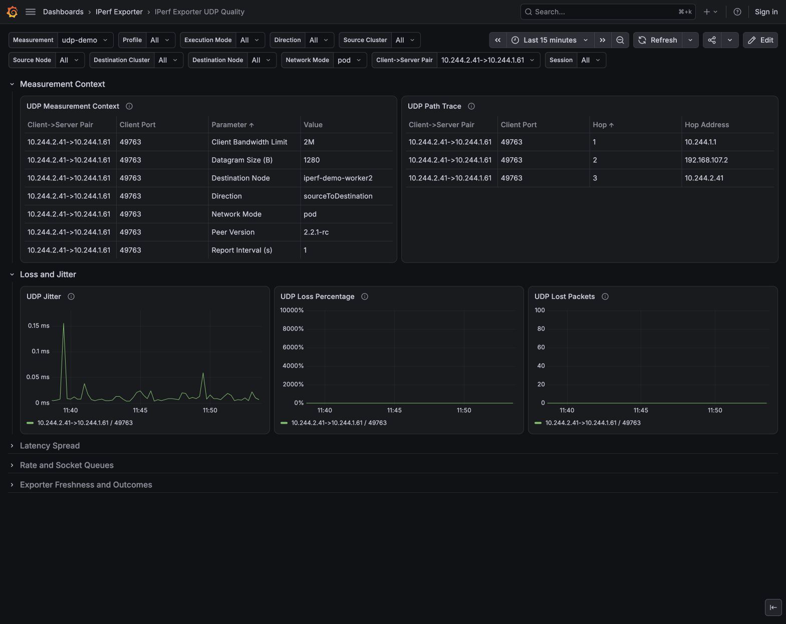

Packet loss and jitter.

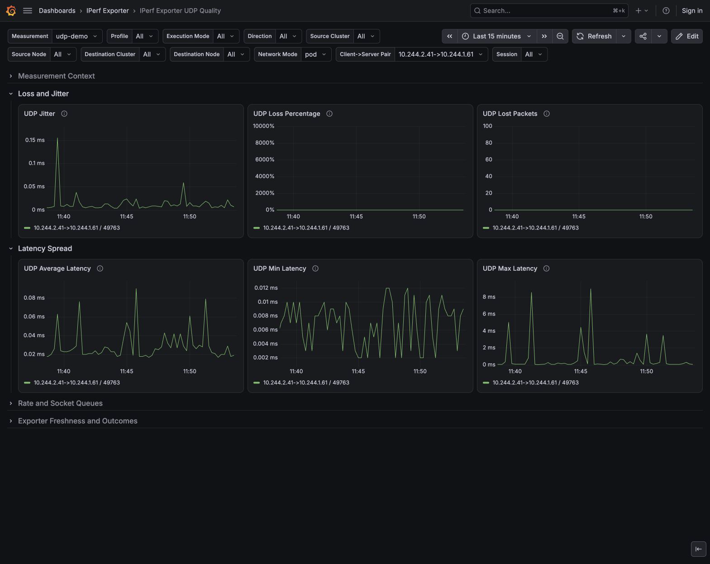

Latency spread, packet rate and socket queues.

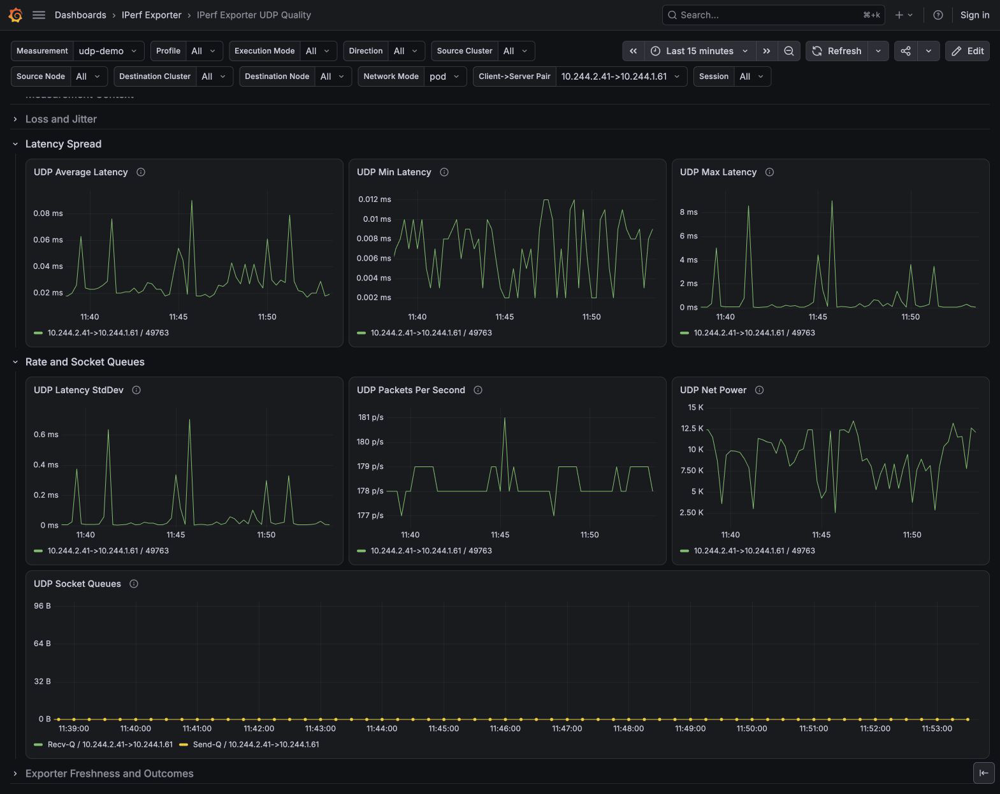

Exporter availability, sample freshness and test outcomes.

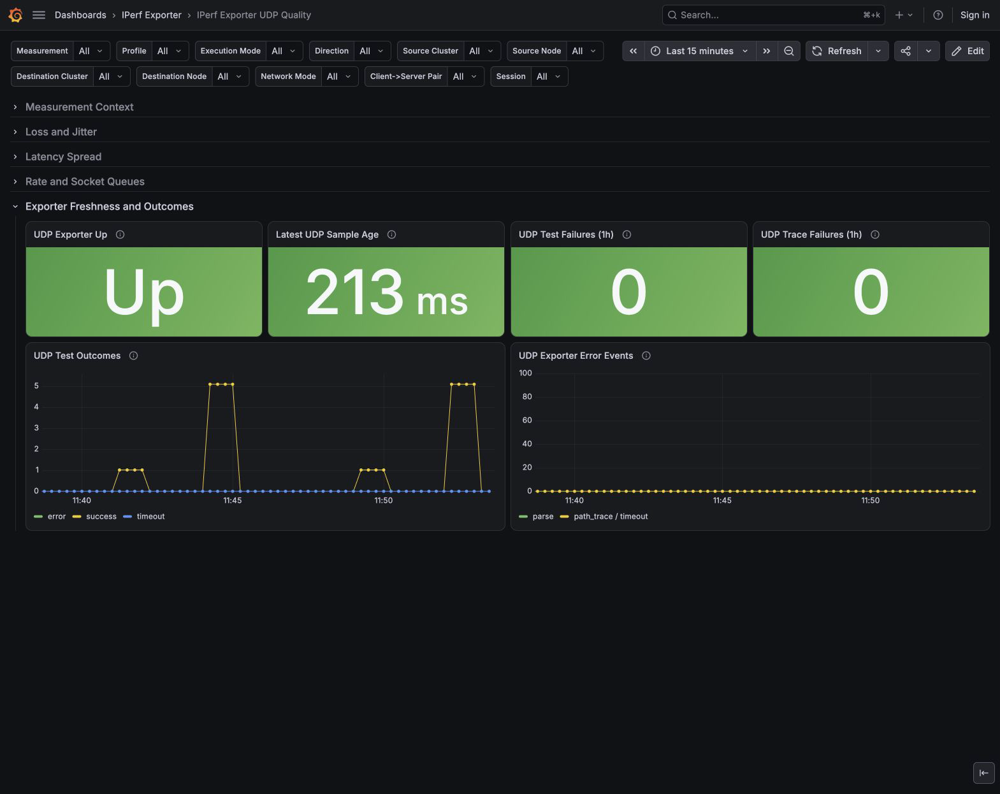

Read the [metrics reference](metrics.md) for units, counter semantics and the
clock synchronization requirements of one-way latency measurements.
